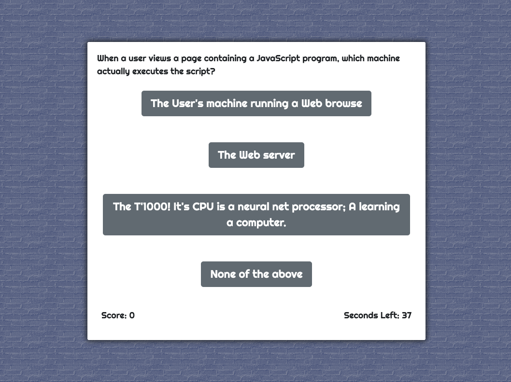

# Week-4-Web-APIs-Code-Quiz

## Thomas Bragg Homework-4 Code Quiz

* ['Github Repository'](https://github.com/TBragg800/Week-4-Web-APIs-Code-Quiz)
* ['Github Deployed Site'](https://tbragg800.github.io/Week-4-Web-APIs-Code-Quiz/)

### Summary:
This assignment contains a timed multiple choice code quiz. The quiz runs in the browser and utilizes Javascript to  dynamically power the HTML and CSS code. The user will notice the interface to be responsive and adaptive to multiple screen sizes.

### Psuedo Code:
* Needs div to hold test
* Div to hold question
* Needs div to hold possible choices
* Needs div for control buttons: Next and Start
* Span tags to hold score and timer
* Timer clock that begins after start
* Place to save initals and score
* Needs style to contour and color the container div
* Stacked buttons
* Style to hide buttons, possibly in bootstrap
* Variables to select start button and access questions
* Questions array/object  
* addEventListeners for buttons
* Functions for start of quiz, next question and selecting answer

### Features:
* A start button to initiate quiz.
* The timer is initiated with the start of the quiz.
* The question appends to the page with the accompanying choices.
* The questions appear in a random order.

### Code Validator
* Code validation by W3C for HTML and CSS

